<div align="center">

# 🚀 Multi-Tenant CRM

### Enterprise-Grade Multi-Tenant Customer Relationship Management Platform

A modern, scalable, and production-ready **Multi-Tenant CRM** built with **Laravel 12**, designed for startups, agencies, SaaS companies, and enterprises. It enables multiple organizations to manage customers, leads, deals, teams, tasks, and business operations from completely isolated workspaces under a single application.

<p align="center">


</p>

<p align="center">

Enterprise CRM • SaaS Ready • Multi-Tenant • REST API • Docker • CI/CD • Queue • Notifications

</p>

---

[✨ Features](#-features)

•

[📷 Screenshots](#-screenshots)

•

[🏗 Architecture](#-system-architecture)

•

[🛠 Tech Stack](#-technology-stack)

•

[📦 Installation](#-installation)

•

[📡 API](#-rest-api)

•

[🤝 Contributing](#-contributing)

</div>

---

# 📖 Overview

Multi-Tenant CRM is a **production-ready Software as a Service (SaaS)** platform where multiple organizations can register and securely manage their business using isolated workspaces.

Every company has its own:

- Users
- Customers
- Leads
- Deals
- Contacts
- Pipelines
- Tasks
- Activities
- Notes
- Files
- Reports
- Settings

without sharing data with other organizations.

The application follows modern Laravel architecture, clean coding principles, SOLID design, Repository Pattern, Service Layer, Queue Processing, API-first development, and enterprise security standards.

---

# 🌟 Key Highlights

- 🏢 Multi-Tenant SaaS Architecture
- 👥 Team Collaboration
- 📞 Customer Management
- 💼 Sales Pipeline
- 📅 Task & Calendar
- 📈 Reports & Analytics
- 🔐 Role Based Access Control
- 🔔 Notifications
- 📧 Email Integration
- 📂 File Manager
- ⚡ Queue Processing
- 📡 REST API
- 🐳 Docker Support
- ☁ AWS Ready
- 🚀 CI/CD Ready

---

# 📷 Screenshots

## Dashboard

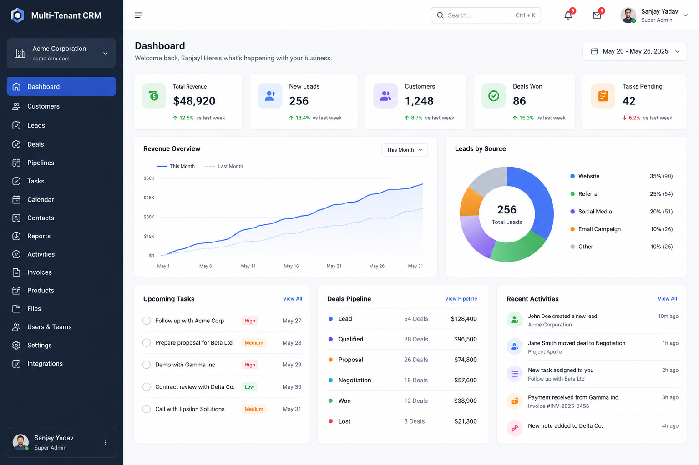

Real-time dashboard displaying business insights, KPIs, revenue, leads, customer growth, upcoming tasks, and organization statistics.

---

## Login

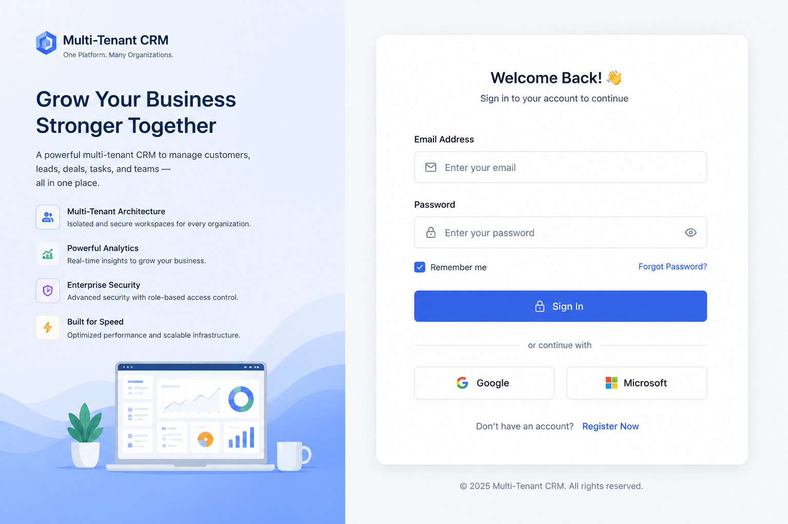

Secure authentication with email verification, remember me, password reset, and optional Two-Factor Authentication.

---

## Organizations

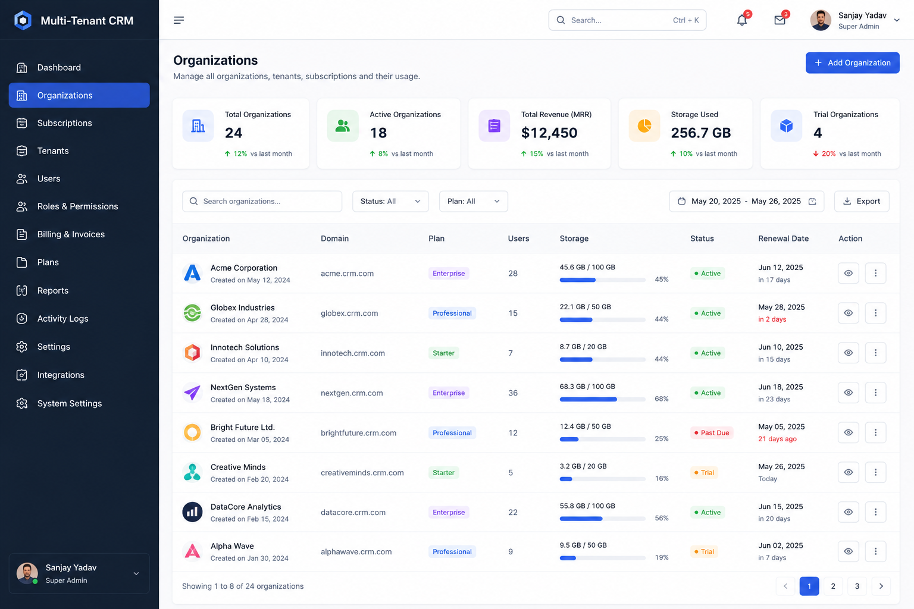

Manage multiple organizations, subscriptions, plans, tenant settings, storage limits, and billing information.

---

## Customers

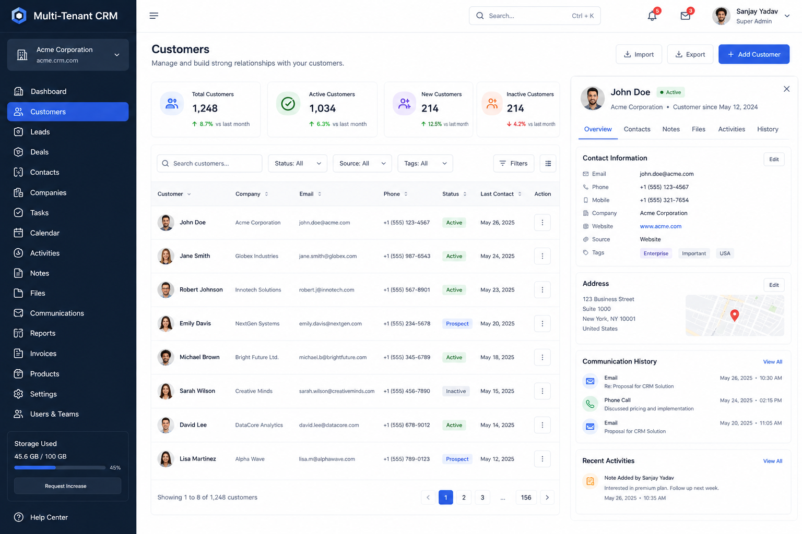

Comprehensive customer management including contacts, notes, addresses, communication history, files, and activities.

---

## Leads

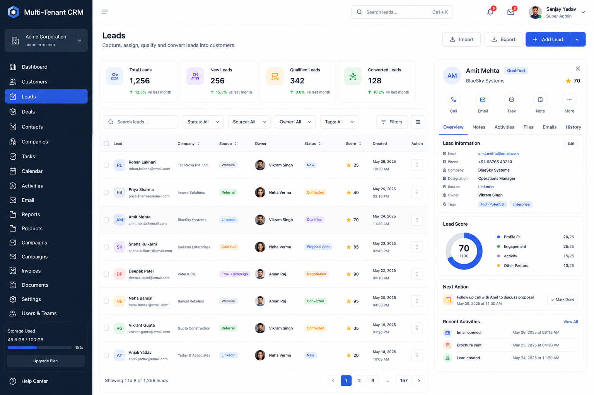

Capture, assign, qualify, and convert leads through customizable sales workflows.

---

## Sales Pipeline

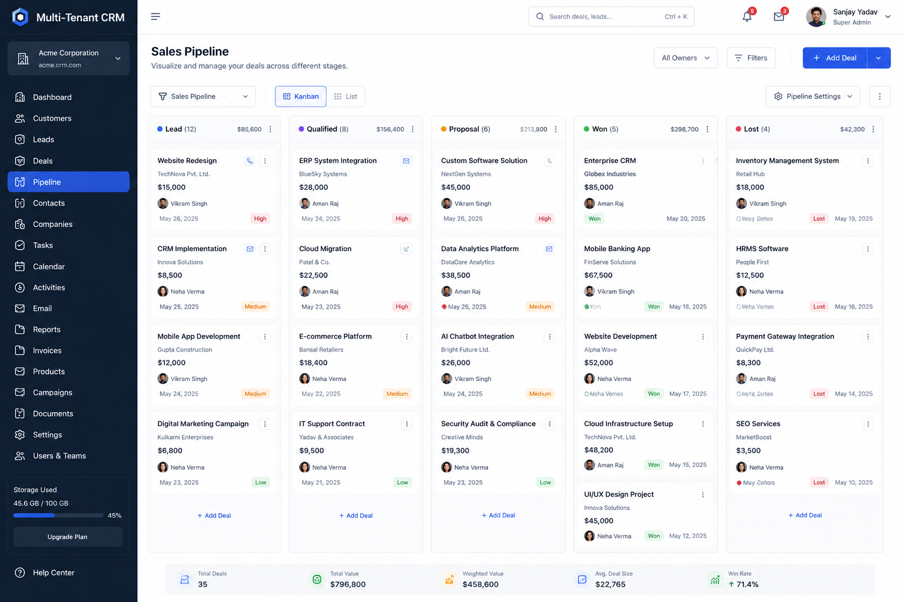

Visual Kanban board to track opportunities from Lead → Qualified → Proposal → Won → Lost.

---

## Reports

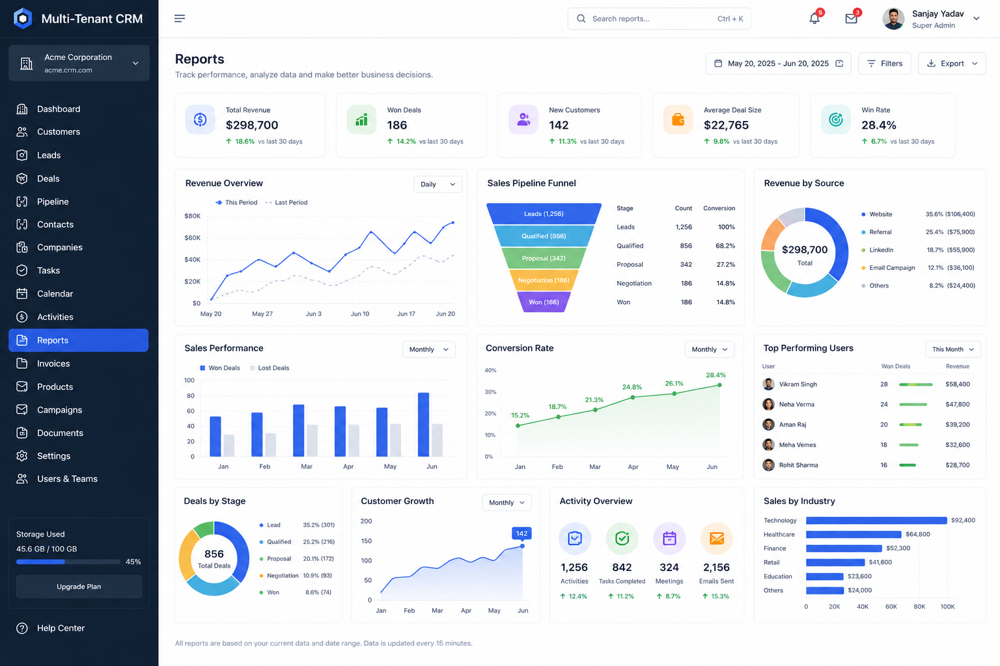

Interactive dashboards with sales performance, revenue, conversion rate, user productivity, and customer analytics.

---

## Settings

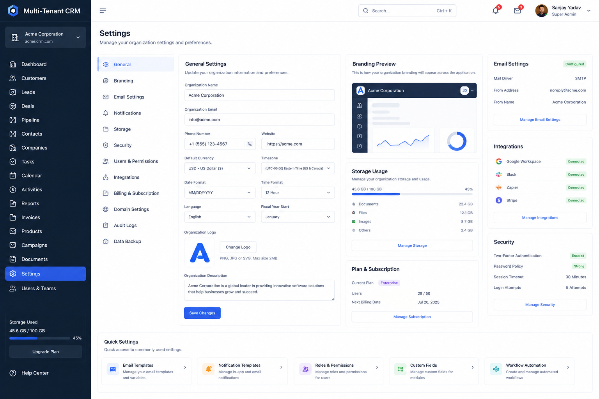

Configure tenant preferences, branding, email settings, integrations, notifications, storage, and security.

---

## System Architecture

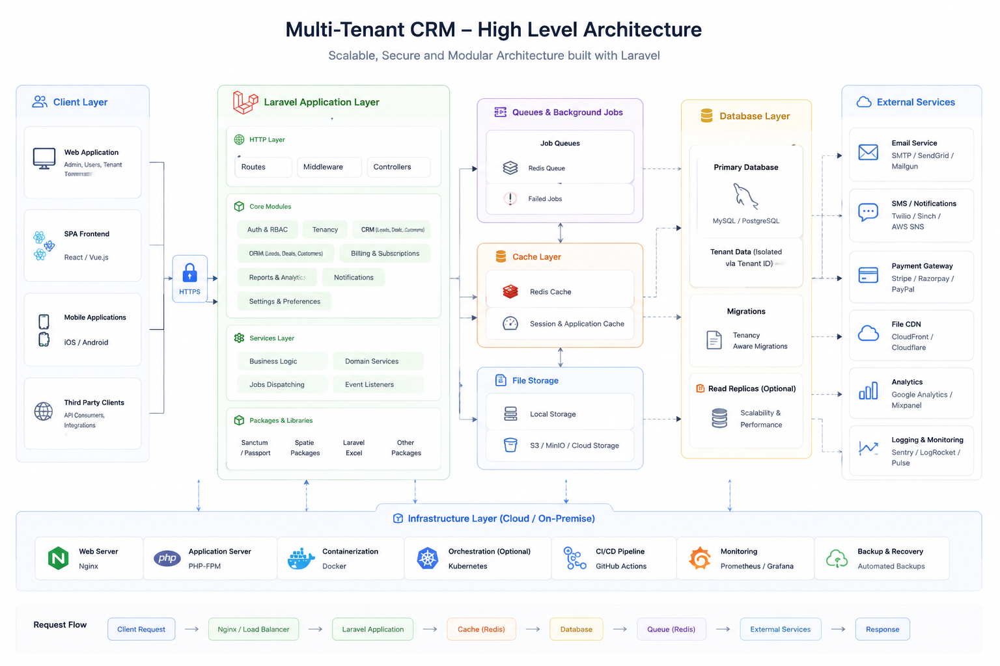

High-level architecture illustrating client layer, Laravel application layer, infrastructure, queues, cache, and external services.

---

## Database Schema

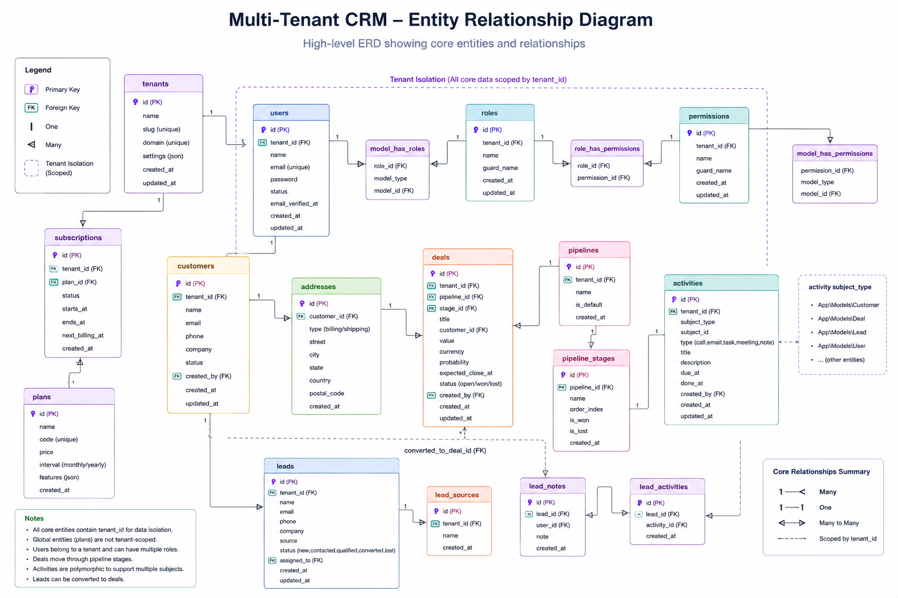

Entity Relationship Diagram representing tenant isolation, users, customers, deals, pipelines, activities, and permissions.

---

## REST API

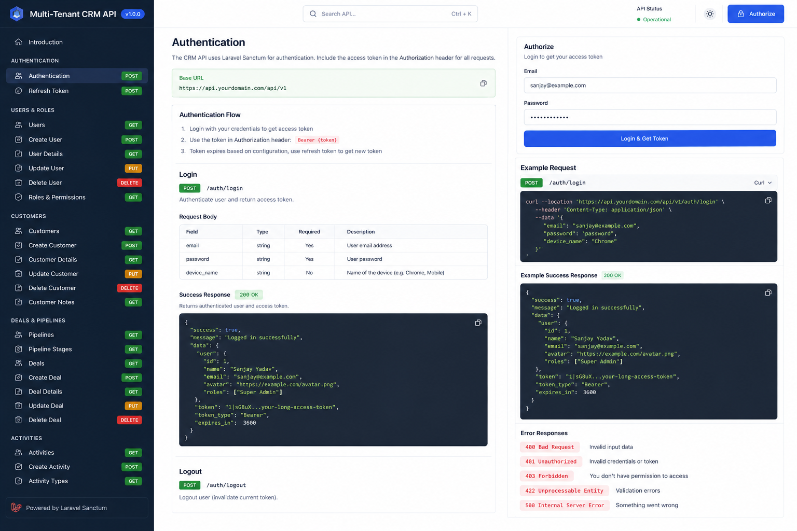

Fully documented REST APIs using Laravel Sanctum authentication.

---

# ✨ Features

## 🏢 Multi-Tenant SaaS

- Tenant Registration
- Workspace Isolation
- Organization Settings
- Custom Branding
- Subscription Plans
- Usage Limits
- Billing Ready
- Domain Mapping (Optional)
- Subdomain Support
- Tenant Switching

---

## 👥 User Management

- User CRUD
- Invite Members
- Teams
- Departments
- Designations
- User Activity
- Profile Management
- Avatar Upload
- Account Status

---

## 🔐 Authentication & Security

- Login
- Registration
- Forgot Password
- Email Verification
- Password Reset
- Laravel Sanctum
- Two-Factor Authentication
- Session Management
- Login History
- Device Management

---

## 🛡 Role & Permission

- Dynamic Roles
- Permissions
- Policies
- Gates
- Middleware Protection
- Super Admin
- Organization Admin
- Managers
- Sales Executives
- Support Team

---

## 👨‍💼 CRM Modules

### Customers

- Customer Profiles
- Contacts
- Addresses
- Communication History
- Customer Notes
- Attachments

### Leads

- Lead Sources
- Lead Assignment
- Qualification
- Status Tracking
- Conversion

### Contacts

- Contact Directory
- Email
- Phone
- Company
- Designation

### Deals

- Sales Opportunities
- Deal Value
- Probability
- Expected Closing
- Revenue Forecast

### Pipelines

- Custom Stages
- Kanban View
- Drag & Drop
- Win/Loss Analysis

---

## 📅 Productivity

- Calendar
- Meetings
- Tasks
- Reminders
- Activity Timeline
- Follow-ups
- Notes
- Comments

---

## 📧 Communication

- Email Templates
- Notifications
- Activity Feed
- Mentions
- Internal Comments
- Attachments

---

## 📂 File Management

- Image Upload
- Documents
- Contracts
- Customer Files
- Storage Management
- AWS S3 Ready

---

## 📊 Reporting

- Sales Reports
- Revenue Reports
- Team Performance
- Customer Analytics
- Lead Conversion
- Monthly Reports
- Custom Reports
- Export CSV
- Export Excel
- Export PDF

---

## ⚙ Settings

- Company Profile
- Branding
- Email
- SMS
- Notification Settings
- Timezone
- Language
- Currency
- Tax Settings

---

## 🔔 Notifications

- Email Notifications
- Database Notifications
- Queue Notifications
- Browser Notifications
- Activity Alerts

---

## ⚡ Performance

- Redis Cache
- Queues
- Lazy Loading Prevention
- Optimized Queries
- Background Jobs
- Scheduler

---

# 🏗 System Architecture

```
                     Internet
                         │
                         ▼
                  Load Balancer
                         │
                         ▼
                Laravel Application
                         │
 ┌────────────────────────────────────────────┐
 │                                            │
 ▼                                            ▼
Authentication                         REST API
 │                                            │
 ▼                                            ▼
Service Layer                     Repository Layer
 │                                            │
 ▼                                            ▼
Business Logic                     Database Layer
 │                                            │
 ▼                                            ▼
Redis Cache                        MySQL Database
 │
 ▼
Queue Workers
 │
 ▼
Notifications / Emails / Jobs
```

---

# 🧩 High-Level Architecture

```
Client Layer
│
├── Web Application
├── Mobile App
├── REST API Clients
└── Third-party Integrations

↓

Application Layer

├── Authentication
├── Multi-Tenant Resolver
├── CRM Modules
├── Service Layer
├── Repository Layer
├── Events
├── Listeners
├── Notifications
├── Queue Jobs

↓

Infrastructure Layer

├── MySQL
├── Redis
├── Queue
├── Storage
├── Mail
├── Cache

↓

External Services

├── AWS S3
├── Stripe
├── SMTP
├── Google OAuth
├── Twilio
└── Webhooks
```

---

# 🛠 Technology Stack

| Category | Technology |
|-----------|------------|
| Backend | Laravel 12 |
| Language | PHP 8.3 |
| Database | MySQL 8 |
| Cache | Redis |
| Queue | Laravel Queue |
| Authentication | Laravel Sanctum |
| Permissions | Spatie Permission |
| Storage | Local / AWS S3 |
| Search | Laravel Scout |
| Frontend | Blade / Vue.js / React *(optional)* |
| Styling | Tailwind CSS |
| JavaScript | Alpine.js |
| Charts | ApexCharts |
| Docker | Docker Compose |
| Testing | PHPUnit |
| API | RESTful API |
| Documentation | Swagger / OpenAPI |
| CI/CD | GitHub Actions |
| Monitoring | Laravel Telescope |
| Debugging | Laravel Debugbar |
| Version Control | Git |

---

# 🎯 Design Principles

This project follows modern enterprise development practices:

- SOLID Principles
- Repository Pattern
- Service Layer Pattern
- Dependency Injection
- Event-Driven Architecture
- API-First Development
- Domain Separation
- Clean Code
- PSR-12 Coding Standards
- Secure by Default
- Testable Architecture

---

# 🚀 Why This Project?

Unlike a traditional CRM, this project is designed as a **true SaaS platform**, allowing hundreds or thousands of organizations to securely operate from a single deployment while maintaining complete data isolation, scalability, and high performance.

It serves as a strong foundation for building:

- CRM Systems
- ERP Platforms
- HRMS
- Property Management
- Inventory Systems
- Healthcare Platforms
- Learning Management Systems (LMS)
- Booking Platforms
- Agency Management Software
- Enterprise SaaS Products

---

# 📦 Installation

## System Requirements

Before installing the project, ensure your environment meets the following requirements.

| Software | Version |
|----------|----------|
| PHP | 8.3+ |
| Composer | Latest |
| MySQL | 8.0+ |
| Node.js | 22+ |
| NPM | Latest |
| Redis | Latest |
| Docker | Latest (Optional) |
| Git | Latest |

---

# 📥 Clone Repository

```bash
git clone https://github.com/yourusername/multi-tenant-crm.git
```

```bash
cd multi-tenant-crm
```

---

# 📦 Install Dependencies

Install PHP packages

```bash
composer install
```

Install JavaScript dependencies

```bash
npm install
```

or

```bash
pnpm install
```

---

# ⚙ Environment Configuration

Copy the example environment file.

```bash
cp .env.example .env
```

Generate application key.

```bash
php artisan key:generate
```

---

# 🗄 Database Configuration

Update your `.env`

```env
APP_NAME="Multi-Tenant CRM"

APP_ENV=local

APP_DEBUG=true

APP_URL=http://crm.test

DB_CONNECTION=mysql

DB_HOST=127.0.0.1

DB_PORT=3306

DB_DATABASE=crm

DB_USERNAME=root

DB_PASSWORD=

CACHE_STORE=redis

QUEUE_CONNECTION=redis

SESSION_DRIVER=redis

REDIS_HOST=127.0.0.1

REDIS_PASSWORD=null

REDIS_PORT=6379

FILESYSTEM_DISK=public

MAIL_MAILER=smtp

MAIL_HOST=mailpit

MAIL_PORT=1025

MAIL_USERNAME=null

MAIL_PASSWORD=null

MAIL_ENCRYPTION=null

MAIL_FROM_ADDRESS=noreply@example.com

MAIL_FROM_NAME="${APP_NAME}"
```

---

# 🚀 Database Migration

```bash
php artisan migrate
```

Seed demo data

```bash
php artisan db:seed
```

or

```bash
php artisan migrate:fresh --seed
```

---

# 🔗 Storage Link

```bash
php artisan storage:link
```

---

# ▶ Run Development Server

Laravel

```bash
php artisan serve
```

Frontend

```bash
npm run dev
```

Visit

```
http://127.0.0.1:8000
```

---

# 🐳 Docker

The project includes Docker support for a consistent development environment.

## Start Containers

```bash
docker compose up -d
```

---

## Stop Containers

```bash
docker compose down
```

---

## Rebuild Containers

```bash
docker compose build
```

---

## Access Application Container

```bash
docker compose exec app bash
```

---

## Run Migrations

```bash
php artisan migrate
```

---

## Queue Worker

```bash
php artisan queue:work
```

---

## Scheduler

```bash
php artisan schedule:work
```

---

# 📂 Docker Services

| Service | Port |
|----------|------|
| Laravel | 8000 |
| MySQL | 3306 |
| Redis | 6379 |
| Mailpit | 8025 |
| Vite | 5173 |

---

# ☁ Supported Deployments

- AWS EC2
- DigitalOcean
- Azure
- Google Cloud
- Render
- Railway
- VPS
- Docker Swarm
- Kubernetes

---

# 🏢 Multi-Tenant Architecture

The CRM follows a **single database multi-tenant architecture** with tenant isolation using an `organization_id`.

Every organization has completely isolated data.

```
Organizations
│
├── Organization A
│     ├── Users
│     ├── Customers
│     ├── Deals
│     ├── Contacts
│     └── Tasks
│
├── Organization B
│     ├── Users
│     ├── Customers
│     ├── Deals
│     ├── Contacts
│     └── Tasks
│
└── Organization C
      ├── Users
      ├── Customers
      ├── Deals
      └── Reports
```

---

## Tenant Resolution

Each request resolves the tenant using one of the following strategies:

- Organization ID
- Subdomain
- Custom Domain
- Authenticated User
- API Token

Example

```
company-a.crm.com

↓

Tenant Resolver

↓

Organization A
```

---

## Data Isolation

Every major table contains:

```sql
organization_id
```

Example

```
customers

organization_id

users

deals

tasks

contacts

activities

notes
```

This ensures complete tenant isolation.

---

# 🛡 Tenant Security

Each request is validated using middleware.

```
Request

↓

Authenticate

↓

Resolve Tenant

↓

Verify Membership

↓

Load Tenant Data

↓

Execute Request
```

No tenant can access another organization's data.

---

# 👥 Roles

Every tenant has independent roles.

```
Super Admin

↓

Organization Owner

↓

Manager

↓

Sales Manager

↓

Sales Executive

↓

Support Executive

↓

Viewer
```

Each organization manages its own permissions.

---

# 🏢 Organization Module

Features

- Company Profile
- Company Logo
- Branding
- Timezone
- Currency
- Language
- Subscription
- Billing
- Team Members
- Departments

---

# 👨‍💼 User Module

- User CRUD
- Invite Users
- Profile
- Password
- Avatar
- Login History
- Devices
- Account Status

---

# 📞 Customer Module

- Customer CRUD
- Customer Contacts
- Customer Notes
- Activities
- Attachments
- Addresses

---

# 🎯 Lead Module

- Capture Leads
- Lead Sources
- Assign Owner
- Qualification
- Convert to Customer
- Follow-up

---

# 💼 Deals Module

- Opportunities
- Pipeline
- Revenue
- Probability
- Closing Date
- Lost Reason

---

# 📅 Calendar Module

- Meetings
- Calls
- Follow-ups
- Tasks
- Reminders

---

# ✅ Task Module

- Task Assignment
- Priority
- Due Date
- Comments
- Attachments
- Checklist

---

# 📝 Notes Module

- Rich Text
- Mention Users
- Files
- Timeline

---

# 📁 Documents Module

- Upload Files
- Contracts
- Images
- PDFs
- Version History

---

# 📊 Reports Module

- Revenue
- Customers
- Sales
- Users
- Deals
- Leads
- Conversion
- Growth

---

# 🔔 Notification Module

Supports

- Email
- Database
- Browser
- Queue
- Slack (Optional)

---

# ⚙ Settings Module

- Company
- Branding
- Email
- SMTP
- Notifications
- Timezone
- Currency
- Language
- Security

---

# 📂 Project Structure

```
app
│
├── Console
├── Enums
├── Events
├── Exceptions
├── Helpers
├── Http
│   ├── Controllers
│   ├── Middleware
│   ├── Requests
│   ├── Resources
│   └── APIs
│
├── Jobs
├── Listeners
├── Mail
├── Models
├── Notifications
├── Observers
├── Policies
├── Providers
├── Repositories
├── Rules
├── Services
├── Traits
└── ViewModels

bootstrap

config

database
│
├── factories
├── migrations
├── seeders

docker

docs

public

resources
│
├── css
├── js
├── views

routes
│
├── api.php
├── web.php
├── console.php

storage

tests

vendor
```

---

# 📁 Important Directories

| Directory | Purpose |
|------------|----------|
| app/Services | Business Logic |
| app/Repositories | Database Layer |
| app/Http | Controllers & Middleware |
| app/Jobs | Queue Jobs |
| app/Events | Events |
| app/Listeners | Event Listeners |
| app/Policies | Authorization |
| database/ | Migrations & Seeders |
| routes/ | Routes |
| resources/ | Frontend Assets |
| storage/ | Logs & Uploads |
| tests/ | Feature & Unit Tests |
| docs/ | Documentation |

---

# 📐 Coding Standards

This project follows:

- PSR-12
- SOLID Principles
- Repository Pattern
- Service Layer Pattern
- Dependency Injection
- Clean Architecture
- Laravel Best Practices
- Feature-based Development

---

# 🌍 Localization

Supported Languages

- English
- Spanish
- French
- German
- Arabic
- Hindi

Additional languages can be added using Laravel Localization.

---

# 🎨 Branding

Every tenant can customize:

- Company Logo
- Company Name
- Favicon
- Primary Color
- Secondary Color
- Email Templates
- Invoice Theme

---

# 🔄 Queue Processing

Background jobs include:

- Email Sending
- Notifications
- Report Generation
- Data Import
- Data Export
- File Processing
- Image Optimization

Powered by Laravel Queue + Redis.

---

# 📡 REST API

The application provides a comprehensive RESTful API that enables seamless integration with mobile applications, third-party services, and external platforms.

The API follows REST principles and uses JSON for all requests and responses.

---

## Authentication

Authentication is powered by **Laravel Sanctum**.

```
Authorization: Bearer {access_token}
```

Supported Authentication Methods

- Email & Password
- Personal Access Tokens
- API Tokens
- OAuth (Optional)
- Social Login (Optional)

---

## API Features

- RESTful Endpoints
- JSON Responses
- Resource Transformers
- Pagination
- Sorting
- Searching
- Filtering
- Rate Limiting
- API Versioning
- Error Handling

---

## API Modules

### Authentication

```
POST   /api/register

POST   /api/login

POST   /api/logout

GET    /api/me

POST   /api/forgot-password

POST   /api/reset-password
```

---

### Organizations

```
GET

POST

PUT

DELETE

/api/organizations
```

---

### Users

```
GET

POST

PUT

DELETE

/api/users
```

---

### Customers

```
GET

POST

PUT

DELETE

/api/customers
```

---

### Contacts

```
GET

POST

PUT

DELETE

/api/contacts
```

---

### Leads

```
GET

POST

PUT

DELETE

/api/leads
```

---

### Deals

```
GET

POST

PUT

DELETE

/api/deals
```

---

### Tasks

```
GET

POST

PUT

DELETE

/api/tasks
```

---

### Activities

```
GET

POST

PUT

DELETE

/api/activities
```

---

### Reports

```
GET

/api/reports/sales

/api/reports/customers

/api/reports/revenue

/api/reports/leads
```

---

### Notifications

```
GET

/api/notifications
```

---

## Example Request

```http
POST /api/login
```

```json
{
    "email": "admin@example.com",
    "password": "password"
}
```

---

## Example Response

```json
{
    "success": true,
    "message": "Login successful",
    "token": "1|AbCdEfGhIjKlMnOpQrStUvWxYz",
    "user": {
        "id": 1,
        "name": "John Doe",
        "email": "admin@example.com"
    }
}
```

---

## HTTP Status Codes

| Code | Meaning |
|------|----------|
| 200 | OK |
| 201 | Created |
| 204 | No Content |
| 400 | Bad Request |
| 401 | Unauthorized |
| 403 | Forbidden |
| 404 | Not Found |
| 422 | Validation Error |
| 429 | Too Many Requests |
| 500 | Server Error |

---

## API Documentation

API documentation is available through:

- Swagger UI
- OpenAPI
- Postman Collection

```
docs/postman/Multi-Tenant-CRM.postman_collection.json
```

---

# 🧪 Testing

The project includes comprehensive automated testing.

## Test Types

- Unit Tests
- Feature Tests
- API Tests
- Integration Tests
- Authentication Tests
- Permission Tests
- Tenant Isolation Tests

---

## Run All Tests

```bash
php artisan test
```

or

```bash
vendor/bin/phpunit
```

---

## Generate Coverage Report

```bash
php artisan test --coverage
```

---

## Code Style

Laravel Pint

```bash
./vendor/bin/pint
```

---

## Static Analysis

PHPStan

```bash
vendor/bin/phpstan analyse
```

---

# 🚀 Performance Optimization

Before deployment

```bash
php artisan optimize
```

---

Cache Configuration

```bash
php artisan config:cache
```

Routes

```bash
php artisan route:cache
```

Views

```bash
php artisan view:cache
```

Events

```bash
php artisan event:cache
```

---

# ⚡ Queue Worker

```bash
php artisan queue:work
```

---

# ⏰ Scheduler

```bash
php artisan schedule:work
```

Production Cron

```bash
* * * * * php artisan schedule:run
```

---

# 🔍 Monitoring

Recommended packages

- Laravel Telescope
- Horizon
- Debugbar
- Sentry
- Bugsnag
- Laravel Pulse

---

# 🔄 CI/CD

GitHub Actions workflow included.

Pipeline

```
Push

↓

Install Dependencies

↓

Run Pint

↓

Run PHPUnit

↓

Static Analysis

↓

Build Assets

↓

Docker Build

↓

Deploy

↓

Notify
```

---

## GitHub Actions

Runs automatically on

- Pull Requests
- Push to Main
- Release Tags

---

## Deployment Strategy

Supports

- Zero Downtime Deployment
- Blue/Green Deployment
- Rolling Deployment

---

# ☁ Production Deployment

Supported Platforms

- AWS EC2
- AWS ECS
- AWS Elastic Beanstalk
- DigitalOcean
- Azure
- Google Cloud
- Render
- Railway
- VPS
- Docker Swarm
- Kubernetes

---

## Deployment Checklist

- Configure Environment
- Configure Queue
- Configure Scheduler
- Configure Redis
- Configure Mail
- Configure Storage
- SSL Certificate
- Optimize Laravel
- Restart Queue Workers

---

## Environment

```bash
APP_ENV=production

APP_DEBUG=false
```

---

# 🔒 Security

Security Features

- CSRF Protection
- XSS Protection
- SQL Injection Protection
- Password Hashing
- Laravel Policies
- Middleware Authorization
- Input Validation
- Rate Limiting
- Tenant Isolation
- Secure Password Reset
- Email Verification

---

# 📈 Scalability

The application is designed to scale horizontally.

Supports

- Multiple Web Servers
- Redis Cache
- Redis Queue
- CDN
- Object Storage
- Load Balancer
- Auto Scaling
- Database Replication

---

# 📋 Project Roadmap

## Version 1.0

- [x] Authentication
- [x] Organizations
- [x] Users
- [x] Roles
- [x] Permissions
- [x] Customers
- [x] Leads
- [x] Deals
- [x] Tasks
- [x] Calendar
- [x] Reports
- [x] Notifications
- [x] REST API
- [x] Docker
- [x] CI/CD

---

## Version 1.5

- [ ] Email Campaigns
- [ ] WhatsApp Integration
- [ ] SMS Gateway
- [ ] Advanced Reports
- [ ] Workflow Automation
- [ ] Approval System

---

## Version 2.0

- [ ] AI Assistant
- [ ] Voice Notes
- [ ] Chat System
- [ ] Video Meetings
- [ ] Kanban Automation
- [ ] Marketplace
- [ ] Plugin System
- [ ] Mobile App
- [ ] GraphQL API

---

# 📖 Documentation

Documentation included

```
README.md

CHANGELOG.md

CONTRIBUTING.md

LICENSE

docs/

docs/images/

docs/postman/

API Documentation

Architecture

ER Diagram
```

---

# 🤝 Contributing

Contributions are welcome!

## Development Workflow

1. Fork the repository

2. Create a feature branch

```bash
git checkout -b feature/amazing-feature
```

3. Commit changes

```bash
git commit -m "feat: add amazing feature"
```

4. Push

```bash
git push origin feature/amazing-feature
```

5. Open a Pull Request

---

## Commit Convention

```
feat:

fix:

docs:

refactor:

style:

test:

chore:
```

Example

```bash
git commit -m "feat: add customer activity timeline"
```

---

# 📝 Changelog

See

```
CHANGELOG.md
```

for version history.

---

# 💬 Support

If you encounter any issues, please create a GitHub Issue.

Feature requests and improvements are always welcome.

---

# 🌟 Show Your Support

If you find this project useful,

⭐ Star the repository

🍴 Fork the repository

📢 Share it with others

---

# 📄 License

This project is licensed under the **MIT License**.

See the

```
LICENSE
```

file for complete license information.

---

# 👨‍💻 Author

## Sanjay Yadav

Senior Full Stack Developer

Specializing in

- Laravel
- PHP
- Python
- Node.js
- React
- Vue.js
- Docker
- AWS
- REST APIs
- SaaS Platforms
- Microservices

---

### Connect with Me

**GitHub**

```
https://github.com/SanjayScripter
```

**LinkedIn**

```
https://linkedin.com/in/s9jay-yadav
```

**Email**

```
your-email@example.com
```

---

# ❤️ Acknowledgements

Special thanks to the amazing open-source community and the Laravel ecosystem.

Built using:

- Laravel
- PHP
- MySQL
- Redis
- Docker
- Tailwind CSS
- Alpine.js
- Spatie Packages
- Laravel Sanctum
- Laravel Pint
- PHPUnit

---

<div align="center">

## ⭐ If you like this project, please give it a star!

Made with ❤️ by **Sanjay Yadav**

</div>